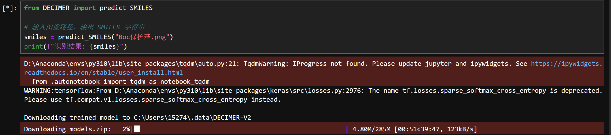
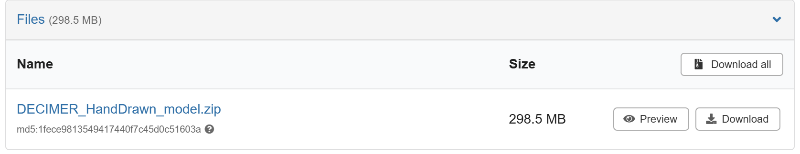
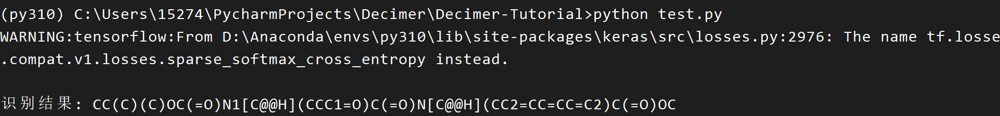
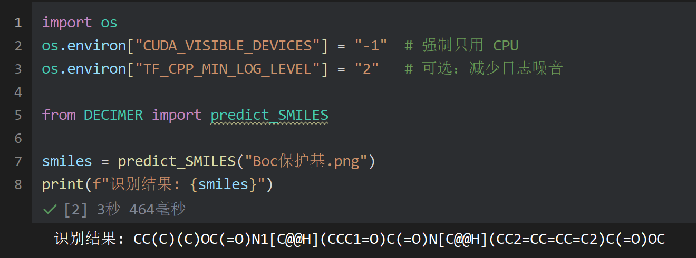

Decimer是一个可以直接识别复杂有机化学结构式并输出smiles式的python库

官方github库为： https://github.com/Kohulan/DECIMER-Image_Transformer

官方化学分子识别体验网站：https://decimer.ai/

本项目由`LHH90538`创造

## 安装教程
1. 首先需要python3.10+环境，建议用conda创建虚拟环境来使用


```
conda create -n py310 python=3.10 -y
conda activate py310
```
2. 然后克隆本项目，安装decimer等必要库，会通过镜像源安装
```
git clone https://github.com/LHH90538/Decimer-Tutorial.git
```
```
pip install -r requirements.txt
```
安装完成后，先运行`test.ipynb`文件，你会发现decimer会从zenodo网站下载2个模型文件.zip压缩包（280MB+280MB）

注意：下载速度较慢（可能30kb/s，需要1小时以上，而且很可能下载失败！）


在此，我寻找了一种较好的方法解决这个问题:

首先记住上面文件自动下载的位置，比如我这边是Users\15274\.data\DECIMER_V2 (目录位置因人而异！)

直接手动在zenodo网站下载zip文件:

在 https://zenodo.org/records/8300489 下载model.zip(298MB)

在 https://zenodo.org/records/10781330 下载DECIMER_HandDrawn_model.zip(298.5MB)


解压后将这两个文件夹放在刚刚提到的Users\15274\.data\DECIMER_V2 (目录位置因人而异！)

文件放置位置如下所示
```
└─DECIMER-V2
    ├─DECIMER_HandDrawn_model
    │  ├─assets
    │  └─variables
    └─DECIMER_model
        ├─assets
        └─variables
```

这样，程序检测到模型文件存在，就不会再去慢慢下载这两个文件了

现在可以安心识别有机化学的图片了，首次运行会加载配置会慢一些

如果在终端运行，会比jupyter中慢一些，其中会输出一些warning日志可不管，大概40+秒，因此非常建议用jupyter运行
我编写代码时禁用了调用GPU，只用CPU推理。因为这个库使用GPU会出很多bug，而且用CPU跟GPU速度差不多

```
cd Decimer-Tutorial/
python test.py
```


在jupyter中运行(见test.ipynb文件)会快更多，大概3-8秒，取决于分子复杂度(如图所示，只用了3秒多，挺快的，跟商业软件差不多，甚至还更快)



令人惊喜的是，Decimer库还能识别Fmoc，Boc，Cbz等保护基，并直接展开。

然而，我在测试时发现decimer库仍然有些bugs，如Ph基团会识别成Pb元素，Ts基团会识别成Ts元素，etc.

对此，我开发了一个改进脚本(见`加强版.ipynb`)，在decimer识别出的smiles基础上，用正则化功能进行修正，并输出结果对比。

最后decimer库+我的改进脚本可以封装成 API 用于搭建各种化学分析网站，本项目采用MIT2.0开放协议

不过这样做仍然有些小bug，比如识别的smiles中[Ts]出现在第一位，转换成甲苯磺酰基时结构有点小错误，不过“[Ts]出现在第一位”这种情况非常少见，基本上可忽略

第一版写于2025/11/11